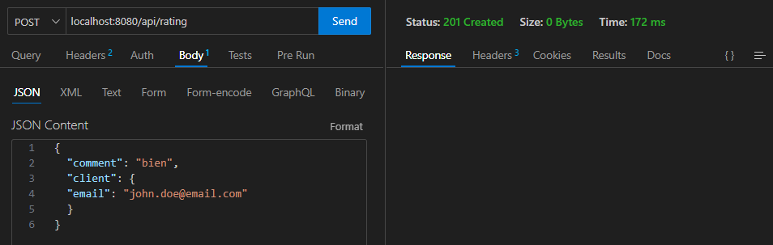
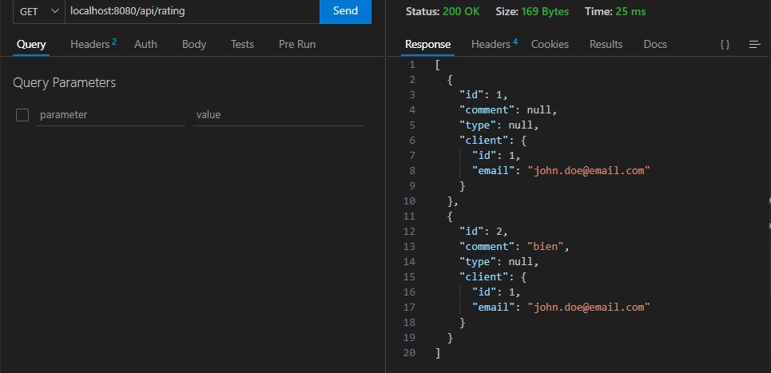
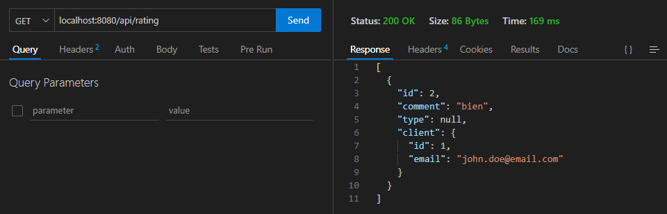
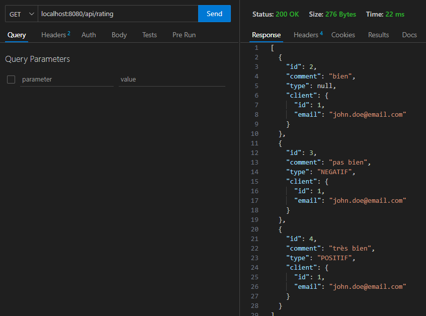

# springBootApi
*sa-backend*  
> [!TIP]
> :shipit: Pour demarrer cette application vous aurez besoin:   
> - [ ] Docker Desktop  
> - [ ] Intellij de préférence (sinon eclipse)  
> - [ ] JDK java  
> - [ ] Une App pour tester des API: POSTMAN, BRUNO, SOAP UI (j'utilise *thunder* client, une extension de l'IDE *VS CODE*)  

>[!NOTE]
>Apres avoir demarre le projet, ont peut lancer les requetes GET  

>[!NOTE]
>Utiisation de l'image Docker MariaBD et creation de container avec la cmd docker-compose up -d  
  

>[!NOTE]
>Exmple d'une requête POST pour créer un Client qui doit retourner 201 + vous pouvez vérifier la table Client  
  
  

>[!NOTE]
>Exemple d'une requête GET pour récuperer les clients de la table *Client*
    

>[!NOTE]
>Exemple d'une requête GET pour lire un client dans la table *Client*   
  

>[!NOTE]
>Exemple d'une requête POST pour poster un commentaire dans la table *Rating*  

>[!NOTE]
>Exemple d'une requête GET pour récupérer les commentaires de la table *Rating*  
  

>[!NOTE]
>Exemple d'une requête DELETE pour supprimer un commentaire  
  
Pour verifier faisons un GET, nous avons bien supprimé le commentaire avec l'ID 1
  

>[!NOTE]
>Exemple d'un requête GET après deux requêtes POST qui définit bien le type de commentaire (NEGATIF ou POSITIF) sur le contrôle du mot __pas__  
> 
