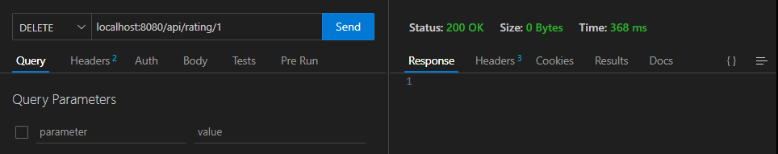

# springBootApi
*sa-backend*

```
@RestController
@RequestMapping(path = "test")
public class TestController {
    @GetMapping
    public List<String> getList() {
        return List.of("chaine de caractère","transmise par sa");
    }
    @GetMapping(path = "string")
    public String getString() {
        return "chaine de caractère transmise par sa";
    }
}
```
>[!NOTE]
>Apres avoir demarre le projet, ont peut lancer les requetes GET  


Utiisation de l'image Docker MariaBD et creation de container avec la cmd docker-compose up -d  
  

Exmple d'une requête POST pour créer un Client qui doit retourner 201 + vous pouvez vérifier la table Client  
  
  

Exemple d'une requête GET pour récuperer les clients de la table *Client*
  
Exemple d'une requête GET pour lire un client dans la table *Client*   
  
Exemple d'une requête POST pour poster un commentaire dans la table *Rating*  



